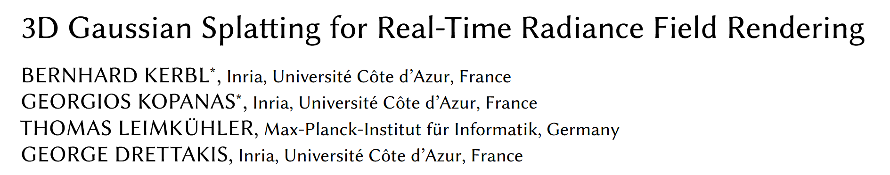

# 3D Gaussian Splatting for Real-Time Radiance Field Rendering  
**Bernhard Kerbl, Georgios Kopanas, Thomas Leimkühler, George Drettakis**  
Inria, Université Côte d’Azur, Max-Planck-Institut für Informatik  
Published in *ACM Transactions on Graphics*, SIGGRAPH 2023

---

## Background

In recent years, Neural Radiance Fields (NeRFs) [Mildenhall et al. 2020] have emerged as a powerful representation for synthesizing novel views of a scene. NeRF models use **multi-layer perceptrons (MLPs)** and **volumetric ray marching**, allowing them to model fine geometry and view-dependent color. However, **NeRFs are notoriously slow** — rendering even a single image can take seconds, and training can take days.

Many methods have tried to accelerate NeRFs:

- **Mip-NeRF360** [Barron et al. 2022] achieves state-of-the-art quality but takes ~48 hours to train.
- **Plenoxels** [Fridovich-Keil et al. 2022] and **InstantNGP** [Müller et al. 2022] significantly reduce training time, but still struggle to render at real-time speeds for 1080p images.

These trade-offs raise a central question:  
> 💡 *Can we achieve both real-time rendering and high quality radiance field representation — without sacrificing speed or memory?*

---

## The Core Idea

This paper proposes a new paradigm: **3D Gaussian Splatting**.

Instead of voxel grids or MLPs, the authors represent scenes using a set of **anisotropic 3D Gaussians** in world space. These Gaussians can be:
- Projected to 2D splats for efficient rasterization,
- Differentiably optimized,
- Interleaved with **adaptive density control**, adding/removing Gaussians as needed.

### Key Formulae:

1. **3D Gaussian definition** (center $\mu$, covariance $\Sigma$):

$$
G(\mathbf{x}) = e^{ -\frac{1}{2} (\mathbf{x} - \mu)^T \Sigma^{-1} (\mathbf{x} - \mu) }
$$

2. **Covariance as ellipsoid** with rotation $R$ and scaling $S$:

$$
\Sigma = R S S^T R^T
$$

3. **Volumetric Rendering Equation** (NeRF-like form):

$$
C = \sum_{i=1}^{N} T_i \alpha_i \mathbf{c}_i
$$

where:

- $\alpha_i = 1 - \exp(-\sigma_i \delta_i)$  
- $T_i = \prod_{j=1}^{i-1} (1 - \alpha_j)$

This equation is also compatible with alpha-blending in point-based rendering. Unlike NeRF, there's no need to march along rays or sample dense volumes.

4. **Projection to 2D** for rasterization (via Jacobian $J$ and camera transformation $W$):

$$
\Sigma' = J W \Sigma W^T J^T
$$

This allows rendering using **tile-based sorting**, enabling real-time rendering and differentiability.

---

## Contributions

This paper introduces:

- A **novel scene representation** using anisotropic 3D Gaussians optimized from SfM points.
- An **interleaved optimization strategy** with adaptive Gaussian densification (clone/split).
- A **real-time differentiable rasterizer** that allows fast training and high-quality rendering.

---

## References

- Mildenhall et al., NeRF: Representing Scenes as Neural Radiance Fields, ECCV 2020  
- Barron et al., Mip-NeRF360: Unbounded Anti-Aliased Neural Radiance Fields, CVPR 2022  
- Fridovich-Keil et al., Plenoxels: Radiance Fields without Neural Networks, CVPR 2022  
- Müller et al., InstantNGP: Instant Neural Graphics Primitives, SIGGRAPH 2022  
- Zwicker et al., EWA Volume Splatting, IEEE Vis 2001


```python
import os
import torch
from random import randint
from utils.loss_utils import l1_loss, ssim
from gaussian_renderer import render, network_gui
import sys
from scene import Scene, GaussianModel
from utils.general_utils import safe_state, get_expon_lr_func
import uuid
import matplotlib.pyplot as plt
from tqdm import tqdm
from utils.image_utils import psnr
from argparse import ArgumentParser, Namespace
from arguments import ModelParams, PipelineParams, OptimizationParams
try:
    from torch.utils.tensorboard import SummaryWriter
    TENSORBOARD_FOUND = True
except ImportError:
    TENSORBOARD_FOUND = False

try:
    from fused_ssim import fused_ssim
    FUSED_SSIM_AVAILABLE = True
except:
    FUSED_SSIM_AVAILABLE = False

try:
    from diff_gaussian_rasterization import SparseGaussianAdam
    SPARSE_ADAM_AVAILABLE = True
except:
    SPARSE_ADAM_AVAILABLE = False
from train import prepare_output_and_logger,training_report
```


    ---------------------------------------------------------------------------

    ModuleNotFoundError                       Traceback (most recent call last)

    Cell In[1], line 5
          3 from random import randint
          4 from utils.loss_utils import l1_loss, ssim
    ----> 5 from gaussian_renderer import render, network_gui
          6 import sys
          7 from scene import Scene, GaussianModel


    File ~/2025/MIT/code/GS/gaussian-splatting-main/gaussian_renderer/__init__.py:16
         14 import sys
         15 sys.path.append('/home/xqgao/2025/MIT/code/GS/gaussian-splatting-main/submodules/diff_gaussian_rasterization')
    ---> 16 from diff_gaussian_rasterization import GaussianRasterizationSettings, GaussianRasterizer
         17 from scene.gaussian_model import GaussianModel
         18 from utils.sh_utils import eval_sh


    ModuleNotFoundError: No module named 'diff_gaussian_rasterization'


```python
def training(dataset, opt, pipe, testing_iterations, saving_iterations, checkpoint_iterations, checkpoint, debug_from):

    if not SPARSE_ADAM_AVAILABLE and opt.optimizer_type == "sparse_adam":
        sys.exit(f"Trying to use sparse adam but it is not installed, please install the correct rasterizer using pip install [3dgs_accel].")

    first_iter = 0
    tb_writer = prepare_output_and_logger(dataset)
    gaussians = GaussianModel(dataset.sh_degree, opt.optimizer_type)
    scene = Scene(dataset, gaussians)
    gaussians.training_setup(opt)
    if checkpoint:
        (model_params, first_iter) = torch.load(checkpoint)
        gaussians.restore(model_params, opt)

    bg_color = [1, 1, 1] if dataset.white_background else [0, 0, 0]
    background = torch.tensor(bg_color, dtype=torch.float32, device="cuda")

    iter_start = torch.cuda.Event(enable_timing = True)
    iter_end = torch.cuda.Event(enable_timing = True)

    use_sparse_adam = opt.optimizer_type == "sparse_adam" and SPARSE_ADAM_AVAILABLE 
    depth_l1_weight = get_expon_lr_func(opt.depth_l1_weight_init, opt.depth_l1_weight_final, max_steps=opt.iterations)

    viewpoint_stack = scene.getTrainCameras().copy()
    viewpoint_indices = list(range(len(viewpoint_stack)))
    ema_loss_for_log = 0.0
    ema_Ll1depth_for_log = 0.0

    progress_bar = tqdm(range(first_iter, opt.iterations), desc="Training progress")
    first_iter += 1
    for iteration in range(first_iter, opt.iterations + 1):
        if network_gui.conn == None:
            network_gui.try_connect()
        while network_gui.conn != None:
            try:
                net_image_bytes = None
                custom_cam, do_training, pipe.convert_SHs_python, pipe.compute_cov3D_python, keep_alive, scaling_modifer = network_gui.receive()
                if custom_cam != None:
                    net_image = render(custom_cam, gaussians, pipe, background, scaling_modifier=scaling_modifer, use_trained_exp=dataset.train_test_exp, separate_sh=SPARSE_ADAM_AVAILABLE)["render"]
                    net_image_bytes = memoryview((torch.clamp(net_image, min=0, max=1.0) * 255).byte().permute(1, 2, 0).contiguous().cpu().numpy())
                network_gui.send(net_image_bytes, dataset.source_path)
                if do_training and ((iteration < int(opt.iterations)) or not keep_alive):
                    break
            except Exception as e:
                network_gui.conn = None

        iter_start.record()

        gaussians.update_learning_rate(iteration)

        # Every 1000 its we increase the levels of SH up to a maximum degree
        if iteration % 1000 == 0:
            gaussians.oneupSHdegree()

        # Pick a random Camera
        if not viewpoint_stack:
            viewpoint_stack = scene.getTrainCameras().copy()
            viewpoint_indices = list(range(len(viewpoint_stack)))
        rand_idx = randint(0, len(viewpoint_indices) - 1)
        viewpoint_cam = viewpoint_stack.pop(rand_idx)
        vind = viewpoint_indices.pop(rand_idx)

        # Render
        if (iteration - 1) == debug_from:
            pipe.debug = True

        bg = torch.rand((3), device="cuda") if opt.random_background else background

        render_pkg = render(viewpoint_cam, gaussians, pipe, bg, use_trained_exp=dataset.train_test_exp, separate_sh=SPARSE_ADAM_AVAILABLE)
        image, viewspace_point_tensor, visibility_filter, radii = render_pkg["render"], render_pkg["viewspace_points"], render_pkg["visibility_filter"], render_pkg["radii"]

        if viewpoint_cam.alpha_mask is not None:
            alpha_mask = viewpoint_cam.alpha_mask.cuda()
            image *= alpha_mask

        # Loss
        gt_image = viewpoint_cam.original_image.cuda()
        Ll1 = l1_loss(image, gt_image)
        if FUSED_SSIM_AVAILABLE:
            ssim_value = fused_ssim(image.unsqueeze(0), gt_image.unsqueeze(0))
        else:
            ssim_value = ssim(image, gt_image)

        loss = (1.0 - opt.lambda_dssim) * Ll1 + opt.lambda_dssim * (1.0 - ssim_value)

        # Depth regularization
        Ll1depth_pure = 0.0
        if depth_l1_weight(iteration) > 0 and viewpoint_cam.depth_reliable:
            invDepth = render_pkg["depth"]
            mono_invdepth = viewpoint_cam.invdepthmap.cuda()
            depth_mask = viewpoint_cam.depth_mask.cuda()

            Ll1depth_pure = torch.abs((invDepth  - mono_invdepth) * depth_mask).mean()
            Ll1depth = depth_l1_weight(iteration) * Ll1depth_pure 
            loss += Ll1depth
            Ll1depth = Ll1depth.item()
        else:
            Ll1depth = 0

        loss.backward()

        iter_end.record()

        with torch.no_grad():
            # Progress bar
            ema_loss_for_log = 0.4 * loss.item() + 0.6 * ema_loss_for_log
            ema_Ll1depth_for_log = 0.4 * Ll1depth + 0.6 * ema_Ll1depth_for_log

            if iteration % 10 == 0:
                progress_bar.set_postfix({"Loss": f"{ema_loss_for_log:.{7}f}", "Depth Loss": f"{ema_Ll1depth_for_log:.{7}f}"})
                progress_bar.update(10)
            if iteration == opt.iterations:
                progress_bar.close()

            # Log and save
            training_report(tb_writer, iteration, Ll1, loss, l1_loss, iter_start.elapsed_time(iter_end), testing_iterations, scene, render, (pipe, background, 1., SPARSE_ADAM_AVAILABLE, None, dataset.train_test_exp), dataset.train_test_exp)
            if (iteration in saving_iterations):
                print("\n[ITER {}] Saving Gaussians".format(iteration))
                scene.save(iteration)

            # Densification
            if iteration < opt.densify_until_iter:
                # Keep track of max radii in image-space for pruning
                gaussians.max_radii2D[visibility_filter] = torch.max(gaussians.max_radii2D[visibility_filter], radii[visibility_filter])
                gaussians.add_densification_stats(viewspace_point_tensor, visibility_filter)

                if iteration > opt.densify_from_iter and iteration % opt.densification_interval == 0:
                    size_threshold = 20 if iteration > opt.opacity_reset_interval else None
                    gaussians.densify_and_prune(opt.densify_grad_threshold, 0.005, scene.cameras_extent, size_threshold, radii)
                
                if iteration % opt.opacity_reset_interval == 0 or (dataset.white_background and iteration == opt.densify_from_iter):
                    gaussians.reset_opacity()

            # Optimizer step
            if iteration < opt.iterations:
                gaussians.exposure_optimizer.step()
                gaussians.exposure_optimizer.zero_grad(set_to_none = True)
                if use_sparse_adam:
                    visible = radii > 0
                    gaussians.optimizer.step(visible, radii.shape[0])
                    gaussians.optimizer.zero_grad(set_to_none = True)
                else:
                    gaussians.optimizer.step()
                    gaussians.optimizer.zero_grad(set_to_none = True)

            if (iteration in checkpoint_iterations):
                print("\n[ITER {}] Saving Checkpoint".format(iteration))
                torch.save((gaussians.capture(), iteration), scene.model_path + "/chkpnt" + str(iteration) + ".pth")

if __name__ == "__main__":
    import sys
    from argparse import ArgumentParser

    # 手动模拟命令行参数
    sys.argv = ['']
    # Set up command line argument parser
    parser = ArgumentParser(description="Training script parameters")
    lp = ModelParams(parser)
    op = OptimizationParams(parser)
    pp = PipelineParams(parser)
    parser.add_argument('--ip', type=str, default="127.0.0.1")
    parser.add_argument('--port', type=int, default=6009)
    parser.add_argument('--debug_from', type=int, default=-1)
    parser.add_argument('--detect_anomaly', action='store_true', default=False)
    parser.add_argument("--test_iterations", nargs="+", type=int, default=[7_000, 30_000])
    parser.add_argument("--save_iterations", nargs="+", type=int, default=[7_000, 30_000])
    parser.add_argument("--quiet", action="store_true")
    parser.add_argument('--disable_viewer', action='store_true', default=False)
    parser.add_argument("--checkpoint_iterations", nargs="+", type=int, default=[])
    parser.add_argument("--start_checkpoint", type=str, default = None)
    args = parser.parse_args(sys.argv[1:])

    args.save_iterations.append(args.iterations)
    
    print("Optimizing " + args.model_path)

    # Initialize system state (RNG)
    safe_state(args.quiet)

    # Start GUI server, configure and run training
    if not args.disable_viewer:
        network_gui.init(args.ip, args.port)
    torch.autograd.set_detect_anomaly(args.detect_anomaly)
    training(lp.extract(args), op.extract(args), pp.extract(args), args.test_iterations, args.save_iterations, args.checkpoint_iterations, args.start_checkpoint, args.debug_from)

    # All done
    print("\nTraining complete.")

```
