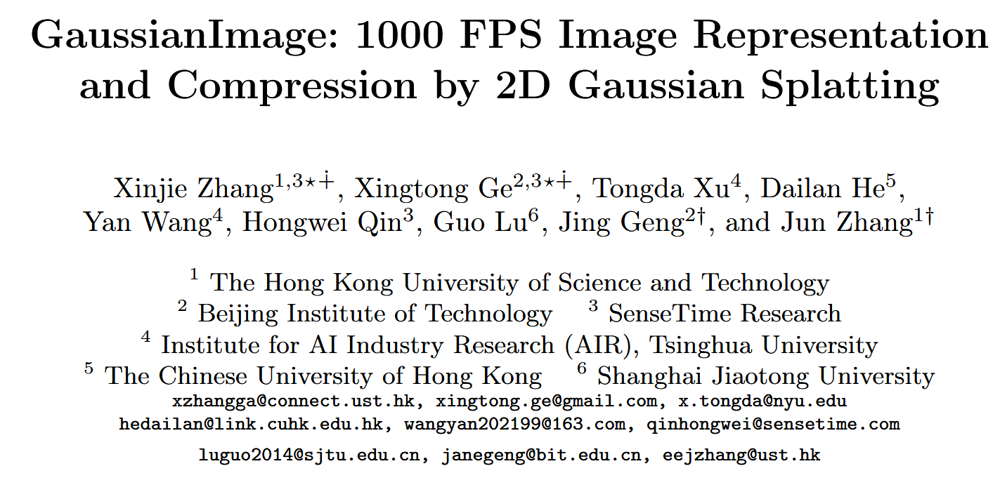

# GaussianImage: 1000 FPS Image Representation and Compression by 2D Gaussian Splatting  
*Xinjie Zhang, Xingtong Ge, Tongda Xu, Dailan He, Yan Wang, Hongwei Qin, Guo Lu, Jing Geng, Jun Zhang*  
HKUST, BIT, NYU, CUHK, AIR@Tsinghua, SenseTime, SJTU  
arXiv, July 2024  
[[Code]](https://github.com/Xinjie-Q/GaussianImage)

---

## 1. Background

Implicit neural representations (INRs) have recently gained popularity in image processing. These methods represent images as continuous functions, often modeled by MLPs, that map spatial coordinates $(x, y)$ to RGB values.  
Notable methods like SIREN [1] and WIRE [2] show impressive results in terms of image fidelity. However, they also come with significant drawbacks:

- Slow rendering speeds, often below 100 FPS
- High GPU memory usage
- Long training time
- Poor performance on low-end or mobile devices

To address some of these issues, grid-based INRs like I-NGP [3] and NeuRBF [4] use multi-resolution feature grids to speed up training, but they still require large memory and are not suitable for real-time deployment.

Recently, 3D Gaussian Splatting [5] has been proposed in the context of 3D scene reconstruction, providing fast and visually high-quality rendering by explicitly modeling 3D Gaussians. This work inspires The Core Idea of **GaussianImage**, which brings this approach to **2D image representation and compression**.

---

## 2. The Core Idea

GaussianImage replaces MLP-based INRs with **a set of 2D Gaussians**. Each image is represented as a sum of weighted Gaussian functions in 2D space. Every Gaussian is defined by:

- Position $\mu \in \mathbb{R}^2$
- Covariance matrix $\Sigma \in \mathbb{R}^{2 \times 2}$
- Weighted color coefficient $c' \in \mathbb{R}^3$

### 2.1 Covariance matrix factorization

To ensure $\Sigma$ is positive semi-definite, it is represented using Cholesky decomposition:

$$
\Sigma = LL^\top, \quad
L = \begin{bmatrix} l_1 & 0 \\\\ l_2 & l_3 \end{bmatrix}
$$

This form is optimized during training for numerical stability.

---

### 2.2 Accumulated Blending

Instead of traditional $\alpha$-blending, which requires depth sorting and is not applicable to 2D images, GaussianImage uses an **accumulated summation** approach:

$$
C_i = \sum_{n \in N} c_n \cdot \alpha_n = \sum_{n \in N} c_n \cdot o_n \cdot \exp(-\sigma_n)
$$

where $\sigma_n$ is the Mahalanobis distance:

$$
\sigma_n = \frac{1}{2} d_n^\top \Sigma^{-1} d_n
$$

$d_n$ is the offset between the current pixel and the Gaussian center.

To further simplify, color and opacity are merged:

$$
C_i = \sum_{n \in N} c'_n \cdot \exp(-\sigma_n)
$$

This yields a permutation-invariant and highly parallel rendering pipeline.

---

### 2.3 Compression

After overfitting an image with Gaussians, a codec is built by quantizing attributes:

- Position → FP16
- Covariance → 6-bit integers
- Color → Residual Vector Quantization (RVQ)

An optional bits-back coding [6] further improves compression rate:

$$
\text{Saved Bits} = \log(N - K)! - \log(N - K)
$$

This makes the method not only fast but also practical as a neural image codec.

---

## 3. Contributions

- Proposes a new 2D image representation method using Gaussian Splatting
- Introduces accumulated blending rasterization to eliminate depth sorting
- Achieves over **2000 FPS** rendering, with low memory footprint
- Builds a neural image codec with vector quantization and optional bits-back coding
- Matches or surpasses existing INR-based codecs (COIN, COIN++) in compression performance

---

## 4. References

[1] Sitzmann et al., "Implicit Neural Representations with Periodic Activation Functions", NeurIPS 2020  
[2] Saragadam et al., "WIRE: Wavelet Implicit Neural Representations", CVPR 2023  
[3] Müller et al., "Instant Neural Graphics Primitives", SIGGRAPH 2022  
[4] Chen et al., "NeuRBF: Neural Fields with Radial Basis Functions", ICCV 2023  
[5] Kerbl et al., "3D Gaussian Splatting for Real-Time Radiance Field Rendering", SIGGRAPH 2023  
[6] Townsend et al., "Practical Lossless Compression with Latent Variables using Bits-Back Coding", arXiv 2019  


```python
import math
import time
from pathlib import Path
import argparse
import yaml
import numpy as np
import torch
import sys
from PIL import Image
import torch.nn.functional as F
from pytorch_msssim import ms_ssim as ms_ssim_func
from utils import *
from tqdm import tqdm
import random
import torchvision.transforms as transforms
import matplotlib.pyplot as plt
```

## 🧠 SimpleTrainer2d: Training 2D Gaussians to Reconstruct an Image

`SimpleTrainer2d` is a lightweight trainer designed to optimize a set of 2D Gaussians to fit a given image. The goal is to learn $N$ Gaussians that, when rendered, closely match the original image using accumulated blending. The training is based on minimizing the L2 reconstruction loss between the ground truth image $x$ and the rendered image $\hat{x}$:

$$
\mathcal{L}_{\text{rec}} = \| x - \hat{x} \|_2^2
$$

Each Gaussian is parameterized by position $\mu \in \mathbb{R}^2$, covariance matrix $\Sigma \in \mathbb{R}^{2 \times 2}$ (either via Cholesky or RS decomposition), and a weighted color vector $c' \in \mathbb{R}^3$. The rendering equation follows the paper’s accumulated formulation:

$$
\hat{x}_i = \sum_{n=1}^{N} c'_n \cdot \exp\left(-\frac{1}{2} d_n^\top \Sigma_n^{-1} d_n\right)
$$

where $d_n$ is the offset from the pixel $i$ to the center $\mu_n$ of the $n$-th Gaussian.

---

### ⚙️ Initialization

The trainer:
- Loads the image into a tensor (`gt_image`) on GPU.
- Selects the model backend:
  - `GaussianImage_Cholesky`: Uses Cholesky decomposition $\Sigma = LL^\top$
  - `GaussianImage_RS`: Uses Rotation-Scaling decomposition $\Sigma = (RS)(RS)^\top$
  - `3DGS`: Projects 3D Gaussians to 2D, included as a baseline
- Loads pretrained weights if a model path is given.
- Prepares a log directory for saving checkpoints and training curves.

---

### 🔁 Training Loop

The `train()` method runs for a fixed number of iterations (e.g., 30k), calling the model's internal `train_iter()` function. This updates Gaussian parameters using gradient descent (Adan optimizer), and logs:
- Loss $\mathcal{L}_{\text{rec}}$
- Peak signal-to-noise ratio (PSNR), calculated as:

$$
\text{PSNR} = 10 \cdot \log_{10}\left( \frac{1}{\text{MSE}} \right)
$$

Every 10 steps, the progress bar updates with loss and PSNR.

After training, the model is evaluated on:
- PSNR
- Multi-scale SSIM (MS-SSIM)
- Inference speed: averaged over 100 forward passes for FPS calculation.

All results are saved to disk in `.npy` and `.pth` formats.

---

### 🧪 Testing

The `test()` method evaluates the model in inference mode. It:
- Renders the image with `self.gaussian_model()`
- Computes MSE, PSNR, and MS-SSIM against the ground truth
- Optionally saves the rendered image for visual comparison

If enabled, the image is saved as `{image_name}_fitting.png`.

---

### ✅ Summary

`SimpleTrainer2d` offers a modular and extensible pipeline for fitting Gaussian-based image representations. It supports different Gaussian parameterizations, measures both accuracy and speed, and saves logs for downstream analysis. It’s ideal for experiments benchmarking the effectiveness of different 2D Gaussian models on real images.


```python
class SimpleTrainer2d:
    """Trains random 2d gaussians to fit an image."""
    def __init__(
        self,
        image_path: Path,
        num_points: int = 2000,
        model_name:str = "GaussianImage_Cholesky",
        iterations:int = 30000,
        model_path = None,
        args = None,
    ):
        self.device = torch.device("cuda:0")
        self.gt_image = image_path_to_tensor(image_path).to(self.device)

        self.num_points = num_points
        image_path = Path(image_path)
        self.image_name = image_path.stem
        BLOCK_H, BLOCK_W = 16, 16
        self.H, self.W = self.gt_image.shape[2], self.gt_image.shape[3]
        self.iterations = iterations
        self.save_imgs = args.save_imgs
        self.log_dir = Path(f"/home/xqgao/2025/MIT/code/GS/GaussianImage-main/checkpoints/{args.data_name}/{model_name}_{args.iterations}_{num_points}/{self.image_name}")
        
        if model_name == "GaussianImage_Cholesky":
            from gaussianimage_cholesky import GaussianImage_Cholesky
            self.gaussian_model = GaussianImage_Cholesky(loss_type="L2", opt_type="adan", num_points=self.num_points, H=self.H, W=self.W, BLOCK_H=BLOCK_H, BLOCK_W=BLOCK_W, 
                device=self.device, lr=args.lr, quantize=False).to(self.device)

        elif model_name == "GaussianImage_RS":
            from gaussianimage_rs import GaussianImage_RS
            self.gaussian_model = GaussianImage_RS(loss_type="L2", opt_type="adan", num_points=self.num_points, H=self.H, W=self.W, BLOCK_H=BLOCK_H, BLOCK_W=BLOCK_W, 
                device=self.device, lr=args.lr, quantize=False).to(self.device) 

        elif model_name == "3DGS":
            from gaussiansplatting_3d import Gaussian3D
            self.gaussian_model = Gaussian3D(loss_type="Fusion2", opt_type="adan", num_points=self.num_points, H=self.H, W=self.W, BLOCK_H=BLOCK_H, BLOCK_W=BLOCK_W, 
                device=self.device, sh_degree=args.sh_degree, lr=args.lr).to(self.device)

        self.logwriter = LogWriter(self.log_dir)

        if model_path is not None:
            print(f"loading model path:{model_path}")
            checkpoint = torch.load(model_path, map_location=self.device)
            model_dict = self.gaussian_model.state_dict()
            pretrained_dict = {k: v for k, v in checkpoint.items() if k in model_dict}
            model_dict.update(pretrained_dict)
            self.gaussian_model.load_state_dict(model_dict)

    def train(self):     
        psnr_list, iter_list = [], []
        progress_bar = tqdm(range(1, self.iterations+1), desc="Training progress")
        best_psnr = 0
        self.gaussian_model.train()
        start_time = time.time()
        for iter in range(1, self.iterations+1):
            loss, psnr = self.gaussian_model.train_iter(self.gt_image)
            psnr_list.append(psnr)
            iter_list.append(iter)
            with torch.no_grad():
                if iter % 10 == 0:
                    progress_bar.set_postfix({f"Loss":f"{loss.item():.{7}f}", "PSNR":f"{psnr:.{4}f},"})
                    progress_bar.update(10)
        end_time = time.time() - start_time
        progress_bar.close()
        psnr_value, ms_ssim_value = self.test()
        with torch.no_grad():
            self.gaussian_model.eval()
            test_start_time = time.time()
            for i in range(100):
                _ = self.gaussian_model()
            test_end_time = (time.time() - test_start_time)/100

        self.logwriter.write("Training Complete in {:.4f}s, Eval time:{:.8f}s, FPS:{:.4f}".format(end_time, test_end_time, 1/test_end_time))
        torch.save(self.gaussian_model.state_dict(), self.log_dir / "gaussian_model.pth.tar")
        np.save(self.log_dir / "training.npy", {"iterations": iter_list, "training_psnr": psnr_list, "training_time": end_time, 
        "psnr": psnr_value, "ms-ssim": ms_ssim_value, "rendering_time": test_end_time, "rendering_fps": 1/test_end_time})
        return psnr_value, ms_ssim_value, end_time, test_end_time, 1/test_end_time


    def test(self):
        self.gaussian_model.eval()
        with torch.no_grad():
            out = self.gaussian_model()

        mse_loss = F.mse_loss(out["render"].float(), self.gt_image.float())
        psnr = 10 * math.log10(1.0 / mse_loss.item())
        ms_ssim_value = ms_ssim_func(out["render"].float(), self.gt_image.float(), data_range=1, size_average=True).item()

        self.logwriter.write("Test PSNR:{:.4f}, MS_SSIM:{:.6f}".format(psnr, ms_ssim_value))

        if self.save_imgs:
            transform = transforms.ToPILImage()
            img = transform(out["render"].float().squeeze(0))

            # Save image
            name = self.image_name + "_fitting.png"
            img.save(str(self.log_dir / name))

            # Show image with matplotlib
            plt.imshow(img)
            plt.title(f"Prediction: {self.image_name}")
            plt.axis("off")
            plt.show()

        return psnr, ms_ssim_value

```


```python
def image_path_to_tensor(image_path: Path):
    img = Image.open(image_path)
    transform = transforms.ToTensor()
    img_tensor = transform(img).unsqueeze(0) #[1, C, H, W]
    return img_tensor

def parse_args(argv):
    parser = argparse.ArgumentParser(description="Example training script.")
    parser.add_argument(
        "-d", "--dataset", type=str, default='/home/xqgao/2025/MIT/Datasets/Kodak', help="Training dataset"
    )
    parser.add_argument(
        "--data_name", type=str, default='kodak', help="Training dataset"
    )
    parser.add_argument(
        "--iterations", type=int, default=50000, help="number of training epochs (default: %(default)s)"
    )
    parser.add_argument(
        "--model_name", type=str, default="GaussianImage_Cholesky", help="model selection: GaussianImage_Cholesky, GaussianImage_RS, 3DGS"
    )
    parser.add_argument(
        "--sh_degree", type=int, default=3, help="SH degree (default: %(default)s)"
    )
    parser.add_argument(
        "--num_points",
        type=int,
        default=50000,
        help="2D GS points (default: %(default)s)",
    )
    parser.add_argument("--model_path", type=str, default=None, help="Path to a checkpoint")
    parser.add_argument("--seed", type=float, default=1, help="Set random seed for reproducibility")
    parser.add_argument("--save_imgs", action="store_true", help="Save image")
    parser.add_argument(
        "--lr",
        type=float,
        default=1e-3,
        help="Learning rate (default: %(default)s)",
    )
    args = parser.parse_args(argv)
    return args

```

## 🚀 main(argv): Batch Image Training and Evaluation

This function runs `SimpleTrainer2d` on an entire dataset (e.g., Kodak or DIV2K). For each image, it trains a set of 2D Gaussians to minimize L2 loss and logs metrics such as PSNR, MS-SSIM, training time, and FPS. All results are saved using `LogWriter`, and the script computes the average performance across all images to evaluate model quality and speed.


```python
argv=sys.argv[1:]
args = parse_args([])  
# Cache the args as a text string to save them in the output dir later
args_text = yaml.safe_dump(args.__dict__, default_flow_style=False)

if args.seed is not None:
    torch.manual_seed(args.seed)
    random.seed(args.seed)
    torch.cuda.manual_seed(args.seed)
    torch.backends.cudnn.deterministic = True
    torch.backends.cudnn.benchmark = False
    np.random.seed(args.seed)

logwriter = LogWriter(Path(f"./checkpoints/{args.data_name}/{args.model_name}_{args.iterations}_{args.num_points}"))
psnrs, ms_ssims, training_times, eval_times, eval_fpses = [], [], [], [], []
image_h, image_w = 0, 0
if args.data_name == "kodak":
    image_length, start = 24, 0
elif args.data_name == "DIV2K_valid_LRX2":
    image_length, start = 100, 800
for i in range(start, start+image_length):
    if args.data_name == "kodak":
        image_path = Path(args.dataset) / f'{i+1}.png'
    elif args.data_name == "DIV2K_valid_LRX2":
        image_path = Path(args.dataset) /  f'{i+1:04}x2.png'

    trainer = SimpleTrainer2d(image_path=image_path, num_points=args.num_points, 
        iterations=args.iterations, model_name=args.model_name, args=args, model_path=args.model_path)
    psnr, ms_ssim, training_time, eval_time, eval_fps = trainer.train()
    psnrs.append(psnr)
    ms_ssims.append(ms_ssim)
    training_times.append(training_time) 
    eval_times.append(eval_time)
    eval_fpses.append(eval_fps)
    image_h += trainer.H
    image_w += trainer.W
    image_name = image_path.stem
    logwriter.write("{}: {}x{}, PSNR:{:.4f}, MS-SSIM:{:.4f}, Training:{:.4f}s, Eval:{:.8f}s, FPS:{:.4f}".format(
        image_name, trainer.H, trainer.W, psnr, ms_ssim, training_time, eval_time, eval_fps))

avg_psnr = torch.tensor(psnrs).mean().item()
avg_ms_ssim = torch.tensor(ms_ssims).mean().item()
avg_training_time = torch.tensor(training_times).mean().item()
avg_eval_time = torch.tensor(eval_times).mean().item()
avg_eval_fps = torch.tensor(eval_fpses).mean().item()
avg_h = image_h//image_length
avg_w = image_w//image_length

logwriter.write("Average: {}x{}, PSNR:{:.4f}, MS-SSIM:{:.4f}, Training:{:.4f}s, Eval:{:.8f}s, FPS:{:.4f}".format(
    avg_h, avg_w, avg_psnr, avg_ms_ssim, avg_training_time, avg_eval_time, avg_eval_fps))    
```

    Training progress: 100%|██████████| 50000/50000 [06:54<00:00, 120.76it/s, Loss=0.0001107, PSNR=39.5578,]


    Test PSNR:39.5580, MS_SSIM:0.998474
    Training Complete in 414.0497s, Eval time:0.00043770s, FPS:2284.6784
    1: 512x768, PSNR:39.5580, MS-SSIM:0.9985, Training:414.0497s, Eval:0.00043770s, FPS:2284.6784


    Training progress: 100%|██████████| 50000/50000 [20:12<00:00, 41.24it/s, Loss=0.0000530, PSNR=42.7581,] 


    Test PSNR:42.7585, MS_SSIM:0.997255
    Training Complete in 1212.2935s, Eval time:0.00050834s, FPS:1967.1988
    2: 512x768, PSNR:42.7585, MS-SSIM:0.9973, Training:1212.2935s, Eval:0.00050834s, FPS:1967.1988


    Training progress: 100%|██████████| 50000/50000 [15:04<00:00, 55.27it/s, Loss=0.0000227, PSNR=46.4439,] 


    Test PSNR:46.4443, MS_SSIM:0.998835

